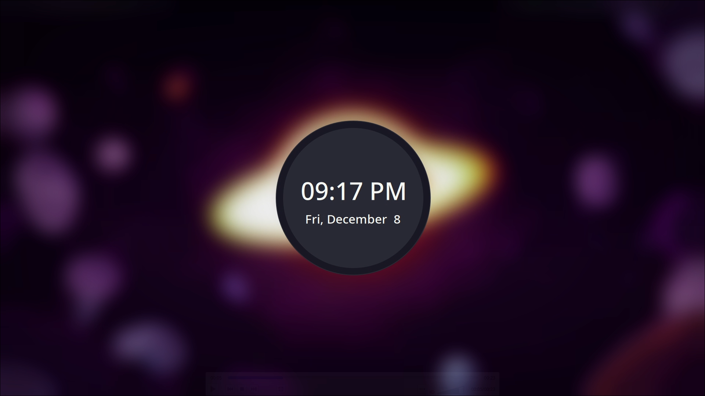

# Dracula for [swaylock]

> A dark theme for [swaylock](https://github.com/swaywm/swaylock).

## Install

## Install using Git
If you are a git user, you can install the theme and keep up to date by cloning the repo:

`git clone https://github.com/dracula/swaylock.git`

### Install manually
Download using the [GitHub .zip download]() option and unzip them.

## Activating theme

`cp -rv swaylock/ ~/.config/`
